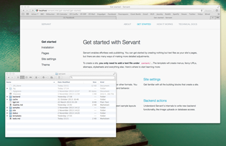
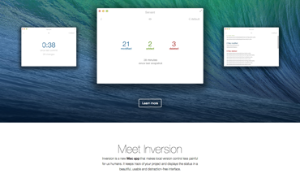

	

		

			

				<h1><strong><a href="/">About Servant</a></strong> <a href="#features" class="scroll">Features</a> <a href="#download" class="scroll">Downloads</a></h1>

				<ul>

					<li><a href="/">About</a></li>
					<li><a href="/tutorials-and-guides">Tutorials &amp; guides</a></li>
					<li><a href="/technical-docs">Technical docs</a></li>

				</ul>
				

			

			<h2>Welcome to Servant *a web framework for human beings</h2>

			

				

					
<em>Servant</em> is a practical and approachable micro framework for web developers, designed for us humans who prefer understandable environments and frequently whip up new web sites.

					
Write pages in <em>Markdown</em>, <em>HTML</em>, <em>PHP</em> or any other of the supported formats. Use the fully automated asset pipeline, <em>LESS</em>+<em>SCSS</em> compilers, fancy URLs, caching... all out-of-the-box. Or write custom backend actions.

				

			

			

				

					
Servant runs on your regular Apache + PHP environment with minimum head scratching. It's open-source and the setup is a breeze &ndash; try it out!

					
<a href="#features" class="button yellow down push-right scroll">Use cases &amp; features</a> <a href="#download" class="button turquoise down scroll">Download 1.0.2</a>

				

			

			

		

		

			

				

					

					
<strong>Usable for everyone in our team</strong>. Producers, designers and developers can all contribute when we use Servant.

				

				

					

					
We publish our <strong>Markdown documentation</strong> with Servant. Docs stay clean for us, users get a usable, beautiful site.

				

				

					

					
A great <strong>lightweight alternative to WordPress or Joomla</strong>. It gives us the things we need with no bloat.

				

				

					

					
I use Servant whenever <strong>I don’t need/want a database</strong>. And when I do, I still build the frontend with Servant.

				

				

			

		

	

	

		<h2>When you just need a web site</h2>

		

			

				
With Servant’s minimum configuration and sensible defaults, you get your home page up in minutes. A basic setup reads your text, Markdown, HTML etc. files and creates a sitemap out of them, styled with the assets you throw at it.

				
<em>You</em> choose whether to start out developing your own layout and look or use existing themes and templates to get output immediately. Servant scales according to your needs &ndash; up to a point, if needed.

				<h3>Work without frustrations</h3>

				
Servant is simple. No installations, no database, no deployments, no admin panels. Edit your site and upload &ndash; that’s it. The lightweight stack is easy to understand, and not a lot of things can go wrong very often.

				<h3>Who is Servant not for?</h3>

				
Servant helps you create <strong>web sites</strong>. It's not a web app platform. There's a fuzzy and shifting line between those, and you need to be the judge.

				
For complex things in the backend, like authentication and heavy database operations, you probably shouldn't use Servant. It's always a great candidate for your user-facing web pages, still: writing your app's business logic and APIs with something like <a href="http://www.playframework.com/" target="_blank">Play Framework</a> while setting up a lightweight client and a marketing site with Servant would be a great idea!

			

		

		

			<h3 class="reset-top">Out-of-the-box features</h3>

			<ul>
				<li>Human-readable URLs</li>
				<li>Asset autoloading, merging + minification</li>
				<li><em>LESS</em> + <em>SCSS</em> support</li>
				<li>Plain text, <em>Markdown</em>, <em>Textile</em>, <em>RST</em> and <em>HTML</em> for pages and templates</li>
				<li><em>PHP</em>, <em>Twig</em>, <em>HAML</em>, <em>Jade</em> for dynamic scripting</li>
				<li>Automatic caching</li>
				<li>Extendable backend actions</li>
				<li>Smart templates generate HTML meta tags</li>
			</ul>

			
All zero-config: change the practical, sensible defaults only if needed.

			<h3>Requirements</h3>

			<ul>
				<li>PHP 5.3 or above</li>
				<li>Apache with rewrite module</li>
			</ul>

			
Drop-in installation, minimum head scratching involved.

		

		

	

	

		

			

				<h2 class="squeeze-top">Download Servant *alpha, Dec 2013</h2>

				

					

						<ul class="plain">

							<li>
								<label class="clear-after">
									<input type="checkbox" checked disabled>
									<h3 class="reset">Servant core</h3>
									
Full backend functionality.

								</label>
							</li>

							<li>
								<label class="clear-after">
									<input type="checkbox" checked disabled>
									<h3 class="reset">Placeholder site files</h3>
									
Settings, icons, a couple of asset files and pages to get you going.

								</label>
							</li>

						</ul>

					

					

						<ul class="plain">

							<li>
								<label class="clear-after">
									<input type="checkbox" checked disabled>
									<h3 class="reset">Documentation</h3>
									
<a href="/technical-docs">Documentation</a> and <a href="/tutorials-and-guides">user guides</a>.

								</label>
							</li>

							<li>
								<label class="clear-after">
									<input type="checkbox" checked disabled>
									<h3 class="reset">Samples</h3>
									
<a href="">7 sample sites</a> for you to explore and try things out with.

								</label>
							</li>

						</ul>

					

				

				
<a href="https://bitbucket.org/Eiskis/servant/get/tip.zip" class="button turquoise accept push-right">Download .zip, 3.2 MB</a> <a href="https://bitbucket.org/Eiskis/servant/src" class="discreet push-right" target="_blank">Repos on Bitbucket</a> Released under <a href="http://www.gnu.org/copyleft/lesser.html" class="discreet" target="_blank">LGPL</a>.

				<!-- 
<a href="" class="button plain forward">Changelog for 1.0.0</a>
 -->

			

		

	

	

		

			

				

					<a class="column buffer half block shadows rounded push-bottom tutorials" href="/tutorials-and-guides">
						<h2 class="reset">Tutorials &amp; guides</h2>
						
Install Servant, get to learn the basics.

					</a>

					<a class="column buffer half last block shadows rounded push-bottom docs" href="/technical-docs">
						<h2 class="reset">Technical docs</h2>
						
Full documentation of Servant insides.

					</a>

					

				

				

				

				

					
<a href="https://groups.google.com/forum/?fromgroups#!forum/servantweb" class="button red forward" target="_blank">Support on Google Groups</a>

				

				

					
<a href="https://bitbucket.org/Eiskis/servant/" class="button blue forward" target="_blank">Contribute on Bitbucket</a>

				

				

				

					

						

							
Servant is authored by <a href="http://eiskis.net/" target="_blank">Jerry Jäppinen</a>. You are welcome to <a href="mailto:eiskis@gmail.com" target="_blank">contact Jerry</a> to ask questions and suggest new features.

						

					

					

						

					

					

				

				

			

			
<a href="/">servantframework.com</a>

		

	

